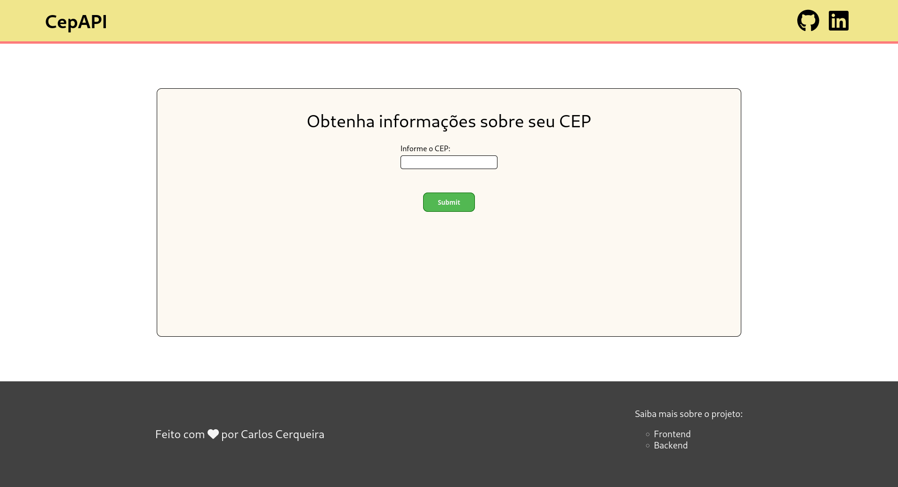
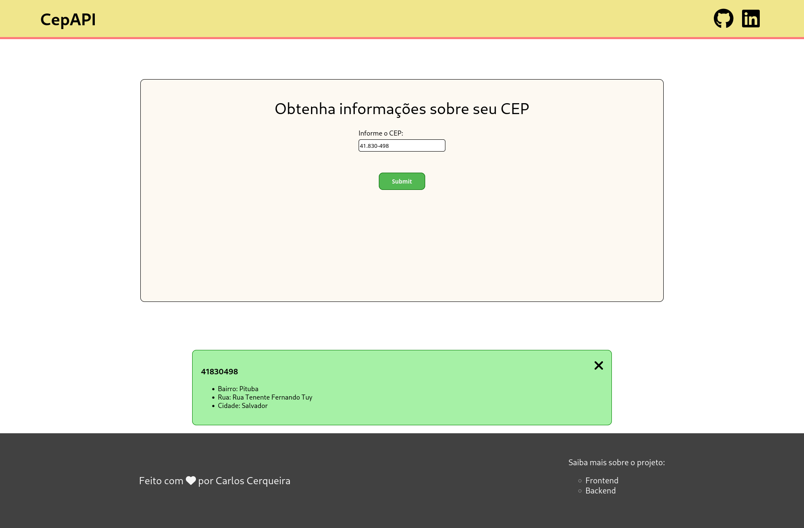
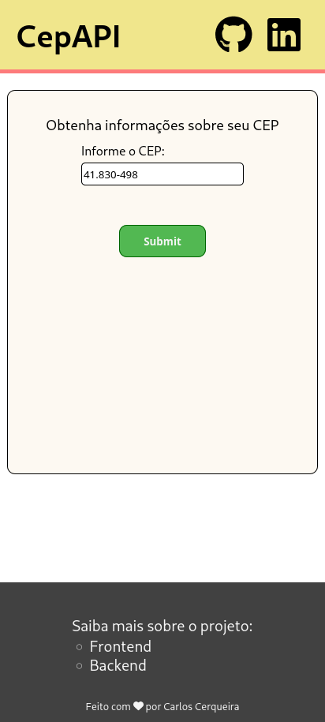
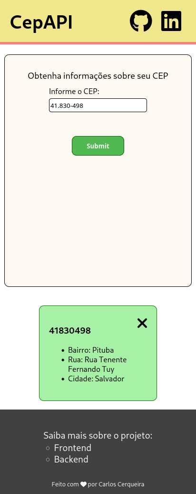

# Desafio Eureka - Frontend

Esse é o frontend do Desafio proposto pela Eureka.

## Rodando o projeto

Primeiro, é necessário baixar todas as dependencias, estamos usando o yarn como package manager. Para instalar as dependencias com o yarn basta:

```bash
yarn
```

Depois de baixarmos todas as dependencias, podemos rodar o projeto com:

```bash
yarn start
```

Caso seja necessário rodar o projeto em produção, utilizamos:

```bash
yarn build
```

E depois, para rodarmos, basta utilizar algum serviço como o `serve`.

## Galeria

#### Desktop





### Mobile



